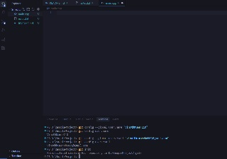
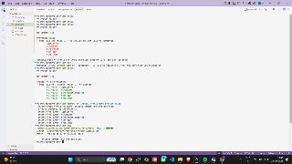
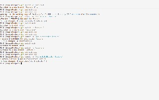

This assignment covers fundamental Git operations including initialization, staging, and the initial commit. Below is the detailed breakdown for each phase.

### Phase 1: Initialization and Setup
**Description:** This phase involves installing Git, configuring user credentials, creating the initial set of project files, and initializing the Git repository.

1.  **Git Installation**: Ensure Git is installed and accessible from the command line.
2.  **User Configuration**:
    *   Set the global username using `git config --global user.name "[NAME]"`.
    *   Set the global user email using `git config --global user.email [EMAIL_ADDRESS]`.
3.  **File Creation**: Create the following files in the project directory:
    *   `README.md`: A Markdown file for project documentation.
    *   `notes.txt`: A text file for general notes.
    *   `main.cpp`: A basic C++ source file.
4.  **Repository Initialization**: Execute `git init` to initialize a new Git repository in the current directory.

### Phase 2: Basic Git Operations
**Description:** This phase involves checking the repository status, adding a `.gitignore` file, staging project files, committing them, and viewing the commit history.

1.  **Check Status**: Used `git status` to see the untracked files.
2.  **Add .gitignore**: Created a `.gitignore` file to ignore compiled object files and OS generated files.
3.  **Stage Files**: Staged all untracked files using `git add .`.
4.  **Commit**: Committed the staged files using `git commit -m "Initial commit with project files"`.
5.  **View History**: Verified the commit was successfully recorded using `git log`.

### Phase 3: Branching Basics
**Description:** This phase involves creating multiple branches, switching between them, and making independent changes to build out the calculator features.

1.  **Feature 1 (Addition)**: Created branch `feature-1` (`git switch -c feature-1`) and implemented the addition function in `main.cpp`, then committed the change.
2.  **Feature 2 (Subtraction)**: Switched back to `main`, created branch `feature-2`, implemented the subtraction function, and committed the change.
3.  **Feature 3 (Multiplication)**: Switched back to `main`, created branch `feature-3`, implemented the multiplication function, and committed the change.

=======

### Phase 4: Merging and Conflict Resolution
**Description:** This phase involves merging branches into the main branch and resolving the resulting merge conflicts that arise when the same lines of code are modified in different branches.

1.  **Merge First Branch**: Switched to main and merged eature-1 smoothly without conflicts.
2.  **Trigger Merge Conflict**: Merged eature-2 into main, triggering a merge conflict in main.cpp.
3.  **Resolve Conflict**: Opened main.cpp in the editor, deleted the conflict markers, and combined the code to keep both features.
4.  **Complete Merge**: Staged the resolved file (git add main.cpp) and committed it to finalize the merge.
5.  **Merge Final Branch**: Merged eature-3 and resolved its conflict similarly.

### Phase 5: Git Stash
**Description:** This phase involves using Git's stash feature to temporarily set aside uncommitted changes, allowing you to switch branches or perform other tasks without losing your work.

1. **Stash Changes**: Made a temporary modification to main.cpp and used git stash to safely save the uncommitted work and clean the working directory.
2. **Switch Branches**: Switched to a new branch (urgent-bug-fix) and back to main to simulate an interruption.
3. **Pop Stash**: Returned to the original work and restored the temporary modifications using git stash pop.

### Phase 6: GitHub Integration
**Description:** This phase involves connecting the local Git repository to a remote repository on GitHub to enable backup, collaboration, and remote tracking.

1.  **Create Remote Repository**: Created a public repository on GitHub named SampleProject.
2.  **Connect Local to Remote**: Linked the local repository to the GitHub repository using git remote add origin <URL>.
3.  **Push to GitHub**: Pushed the local main branch to the remote repository using git push -u origin main.
4.  **Clone and Pull**: Cloned the remote repository to a new directory and pulled the latest changes to verify the connection.

### Phase 7: GitHub Issues & Pull Requests
**Description:** This phase involves using GitHub's collaboration tools to track tasks and propose code changes.

1.  **Create Issue**: Created a new issue on GitHub to track the addition of a Division feature.
2.  **Create Branch**: Created a local branch divide-feature and implemented the division function in main.cpp.
3.  **Push Branch**: Pushed the divide-feature branch to GitHub (git push -u origin divide-feature).
4.  **Pull Request**: Opened a Pull Request on GitHub to merge divide-feature into main and merged it.

### Phase 8: History and Undo Commands
**Description:** This phase involves using Git's powerful history and undo tools to inspect the commit log, fix mistakes, and safely reverse changes.

1.  **View History**: Used git log and git log --oneline to view the full and condensed commit history.
2.  **View Reflog**: Used git reflog to see every action taken in the repository, including resets and checkouts.
3.  **Amend Commit**: Used git commit --amend to fix the last commit message without creating a new commit.
4.  **Revert**: Used git revert HEAD --no-edit to safely undo a commit by creating a new reversal commit (safe for shared repos).
5.  **Reset**: Used git reset --soft HEAD~1 to un-commit while keeping changes staged in the working directory.

### Phase 9: Advanced Git Commands
**Description:** This phase involves using powerful Git commands for history rewriting, code inspection, branch management, and version tagging.

1.  **Rebase**: Created a rebase-test branch, made changes, then rebased it onto main using git rebase rebase-test to replay commits on top of the main branch.
2.  **Interactive Rebase (Squash)**: Used git rebase -i HEAD~3 to combine multiple commits into a single clean commit using the squash option.
3.  **git blame**: Used git blame main.cpp to see who last modified each line of the file and when.
4.  **git clean**: Used git clean -n (dry run preview) and git clean -f to remove untracked files from the working directory.
5.  **Cherry-pick**: Used git cherry-pick <commit-hash> to apply a specific commit from another branch onto the current branch.
6.  **Git Tag**: Created a version tag 1.0 using git tag v1.0 -m "Version 1.0 - Simple Calculator" to mark a stable release point.

